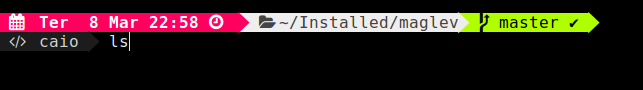
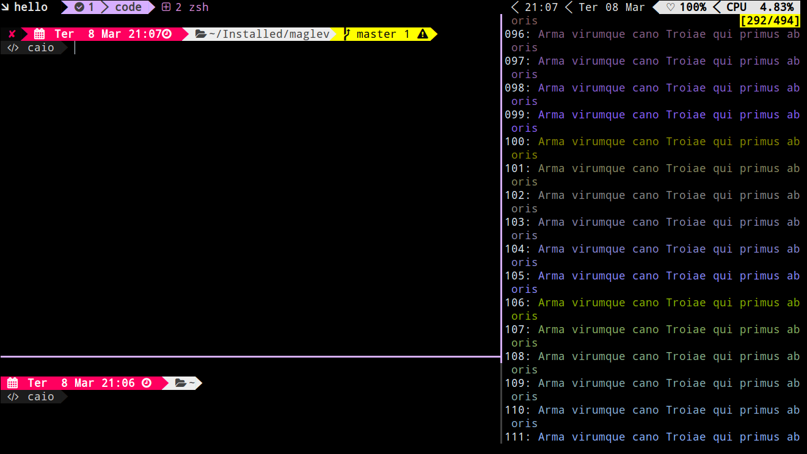

# CP(Agnoster based) for oh-my-zsh
CP is a [oh-my-zsh shell](https://github.com/robbyrussell/oh-my-zsh) theme based on the
[Powerline Vim plugin](https://github.com/Lokaltog/vim-powerline) vim-powerline, agnosterzak-theme &
[Agnoster Theme](https://gist.github.com/agnoster/3712874).


It currently shows:
- Battery Life (in case of the laptop is not charging)
- Timestamp
- Current directory
- Git status
- User & Host status

## Requirements

In order to use the theme, you will first need:

* Powerline compatible fonts like [Powerline patched fonts](https://github.com/Lokaltog/powerline-fonts), [Input Mono](http://input.fontbureau.com/) or [Monoid](http://larsenwork.com/monoid/).
* On Ubuntu like systems you'll need the `ttf-ancient-fonts` package to correctly display some unicode symbols that are not covered by the Powerline fonts above.
* You need to configure your ~/.zshrc file with this script if you use Ubuntu
``` bash
export TERM="xterm-256color" # to enaable all colors used in this theme.
```
* A ZSH framework like [oh-my-zsh](https://github.com/robbyrussell/oh-my-zsh)
* Awesome-terminal fonts [awesome-terminal-fonts](https://github.com/gabrielelana/awesome-terminal-fonts)
* Nerd-fonts [nerd-fonts](https://github.com/ryanoasis/nerd-fonts)


## Installing

After installing [oh-my-zsh](https://github.com/robbyrussell/oh-my-zsh)

1. Download the theme [here](http://raw.github.com/caiocutrim/cp-oh-my-zsh-theme/master/cp.zsh-theme)

2. Put the file **cp.zsh-theme** in **$ZSH_CUSTOM/themes/**

3. You can use the makefile to automatic install the theme on your .oh-my-zsh directory installation

4. If you use gnome-terminal you need to set the terminal font to DejaVu Sans Mono for Powerline and the width of this font is 12.  You can easily do this in the terminal profile options menu on ubuntu.

5. And finally configure the theme in your **~/.zshrc** file:

```bash
ZSH_THEME="cp"
```

## Options

CP is configurable. You can change colors and which segments you want
or don't want to see. All options must be overridden in your **.zshrc** file.

## Some screenshots




This theme is highly inspired by the following themes:
- [Powerline](https://github.com/jeremyFreeAgent/oh-my-zsh-powerline-theme)
- [Agnoster](https://gist.github.com/agnoster/3712874)
